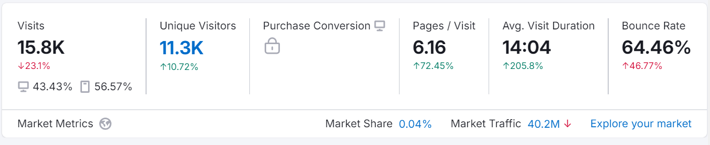
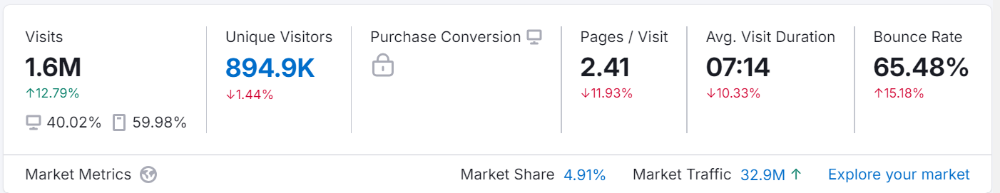
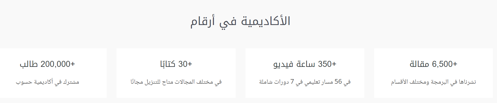
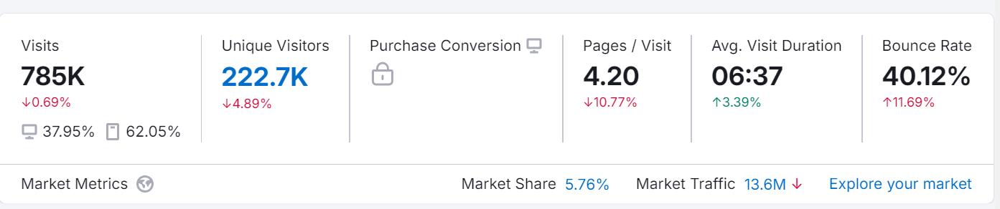
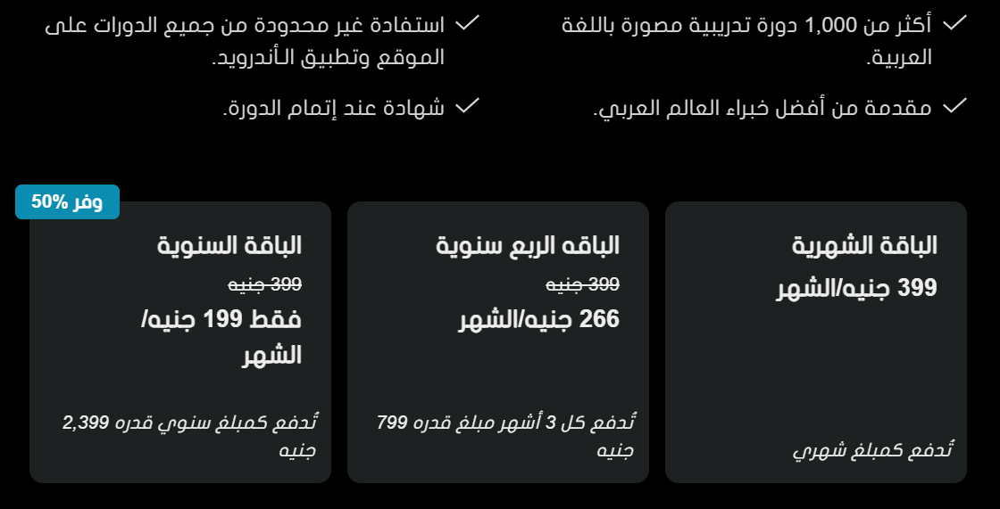
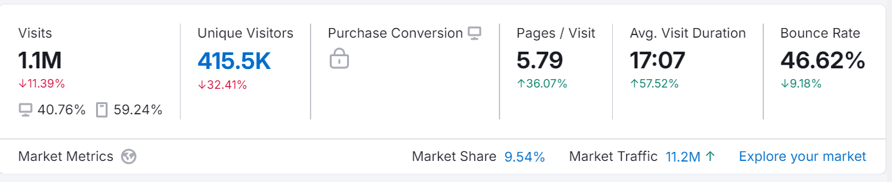
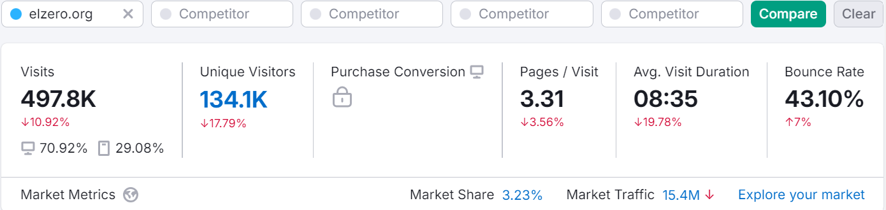
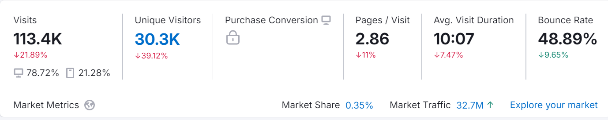

# market research

### Details
conduct competitive market research to identify the gaps between Gammal Tech and its competitors.

### objectives
Building brand awareness and increasing sales for [Gammal Tech](http://www.gammal.tech)

## market research

### Research methods

- Surveys for GT users and other one for public and targeted group
  - [GT survey](https://docs.google.com/forms/d/e/1FAIpQLSexXotwUm5WPz5WimBF1wOwsOvtDRuvTWF0LS-ZTXn3k4r4lA/viewform?usp=sf_link)
  - [all people survey](https://docs.google.com/forms/d/e/1FAIpQLSethwmnlhX50xhA0I3gBDK0wlgy37zkNn3uv_i6tqo9wUom6Q/viewform?usp=sf_link)
- competitor users Feedback 
- Visiting competitors websites
- semrush traffic analysis

# Gamml Tech assessment

## Products and services

### **Courses**

- **200US**:
  - C, Cpp, Data structures, Algorithms, Flutter, Python
- **77US**
  - Html, css 
- **22US**
  - OOP, Entrepreneurship
- **9US**
  - UI/UX, dart, GTK, js, linear algebra, master class

### **Key features** 

- ease of learning, simple explanation, practice exercise exams after each course, certificates, **volunteering** videos on youtube, **internships for one year**, jobs opportunities, **team work**, supporting environment, upcoming potential government certificate equal to universities

### **Limitations**
expensive, unhealthy reputation

### **Basis of cost**
Our courses are designed to help you gain the programming skills in demand in today’s market, guided by experts who will support your journey to success. Key benefits include:
  - **Expert Guidance**: Courses are supervised by industry professionals to ensure a clear path to excellence.
  - **Onsite Exams**: Assess your knowledge through onsite exams after each course and receive valuable feedback from engineers.
  - **Volunteering Programs**: Monthly opportunities to participate in volunteering programs, testing your skills across various departmental tasks.
  - **Internship Opportunities**: Qualify for a one-year internship in a specific department if you successfully complete the volunteering phase.
  - **Recognized Certification**: Earn a certificate from a well-recognized company, with potential government accreditation.
  - **Job Opportunities**: Secure a real job opportunity upon successfully passing all core courses with high performance.

### **Past performance and analytics**
  
  using semrush

  
  
### **Why customer choose GT**

  unfortunately i haven't get enough responses from GT community to my survey, i tried to send it to the HR manager asking her if i can send it to all GT clients by email through her, but she said try GT community. 
  
  according to followers comments in social media i would say that 50% are satisfied, 25% thinks it can be better and 25% was disappointed.

  they choose GT **properly due to the value it offers mentioned below**

### **Why customer don’t choose GT**

unhealthy public awareness and perceptions of Gammal Tech’s brand and offerings and regarding Abdulrahman Algammal, the CEO of Gammal Tech

### **satisfaction level of GT customer**
still need more answers from community..

till now estimations i would say that 50% are satisfied, 25% thinks it can be better and 25% was disappointed. 

### **suggestions from GT customers for service improvement**

still need more answers from community..

### **Opinions regarding pricing**

90% said it is expensive

### **What features do Gammal tech products lack that users are asking for**

still need more answers from community

### **SWOT**

  ease of learning, simple explanation, practice exercise, exams after each course, certificates, **volunteering**, videos on youtube,

  **internships for one year**, jobs opportunities, **team work**, supporting environment

  unhealthy reputation of our CEO, weak content, not suitable pricing, undefined road map and programming knowledge in general, don’t emphasis importance of self learning or refer them to resources

  will try to enhance people perception and thoughts about GT, enhance courses content, more business courses

  people resistance, pricing may be obstacles

# **competitors Profile**

### **hsoub**

  **analytics****:**

  

  

  **SWOT**

  - **available course for wide range of topics**

  - **guarantee** **that you will work as a freelance after the course and earn as much as money you have paid for the course within 6 months, otherwise you will get your course money back**

  - **professional and technical consultation after the course to help you set your CV correctly and to create professional profile on freelancing platforms like mostakl and khamsat**

  - **real world projects**

  - **document your freelancing works and earnings with a serial number service so you can prove that you have experience**  

  - **long life access to courses (only one time payment)**

  - **professional customer services**

  - **whatever course you will take you will get CV and Professional consultation afterwards to help you set your profile in mostakl and khamsat**

  - **positive customer review**

  - **certificate available**

  - **high quality articles in articles in programming, devops, internship, freelance, sales and marketing,  design, application**

  - **books written in arabic explaining programming concepts e:g nodejs book** 

### **almentor**

  **analytics**

  
  
  **Pricing**

  

### **edraak**

  **analytics****:**

  
  
  **free for all**

  ### **Elzero Academy**

  **analytics**:

  
  
  **on youtube:** **1.55 subscribers**

  **SWOT analysis**

  - **amazing reputation, amazing ability to connect with people, free high quality courses, a lot of available communities, a lot of people support, no market tactics used, no paid courses only a chance to support, real world projects practice**

  - **don’t use advertisements to get users, no free  customer services, no professional feedback available to exercise**

### **codezilla**

  **analytics:**

  
  
  **on youtube:** **9.44k**

  **a lot of free courses**

  **SWOT analysis:** 

  - **great reputation, cheap course for its value** 

  - **good customers review, uses his work experiences to market for himself, support of big ones to market for himself, users positive reviews on his course, don’t use advertisements, available customer services in person, support of big names**

# market analysis

  ### 1. **Past and Current Market Conditions**
  - **Market Growth Trends**: Over the past decade, there has been significant growth in the demand for programming education, driven by digital transformation, cloud computing, AI, and machine learning. Platforms offering coding bootcamps, MOOCs, and online tutorials have rapidly expanded.
  - **Shifts Due to the Pandemic**: The COVID-19 pandemic accelerated the adoption of online learning globally, including the Middle East and the Arabian Gulf. This shift heightened demand for remote, flexible, and affordable programming courses.
  - **Current Demand**: Today, demand remains strong as businesses continue to prioritize digital skills, especially for software development, data science, and cybersecurity. This demand is met by a range of providers, from global platforms like Udacity and Coursera to regional players like Hsoub Academy and Edraak in the MENA region.

  ### 2. **Market Attributes**
  - **Diverse Offerings**: The programming education market offers a variety of formats, including bootcamps, on-demand video courses, one-on-one tutoring, and peer-based learning. Platforms like Edraak and Udacity have partnered with local institutions to create tailored learning paths in Arabic, addressing language barriers.
  - **Regional Adaptation**: In regions like the Arabian Gulf, platforms have adapted their curricula to meet local economic needs and focus on in-demand skills like mobile development and data analytics.
  - **Target Audiences**: The market segments include K-12 students, university students, early-career professionals, and even those seeking mid-career transitions into tech roles. Some platforms, like Noon Academy, are designed for younger learners, while others target professionals needing advanced skills.

  ### 3. **Economic and Population Fluctuations**
  - **Population Demographics**: The MENA region, particularly the Arabian Gulf, has a young and growing population, many of whom are eager to enter tech-focused roles. This youth bulge creates a sustained demand for programming and digital skills training.
  - **Economic Shifts**: Economies in the Gulf region are actively diversifying away from oil dependency, investing in tech-driven sectors. Government initiatives, such as Saudi Arabia’s Vision 2030, have spurred educational programs focused on programming and tech, promoting both local and international edtech investments.
  - **Income Disparities and Accessibility**: Economic diversity within the region has led to a mix of free and paid options. Free platforms like One Million Arab Coders serve broader audiences, while paid courses and bootcamps target middle- and high-income segments.

  # **customer Profile**

  ### 1. **Demographic Profile**
  - **Age**: Primarily younger individuals, with a large segment aged between 18-35 years. 
  - **Education Level**: High school graduates, university students, and professionals with an interest in tech and digital skills.
  - **Income Level**: Middle- to high-income brackets
  - **Gender**: Both male and female learners

  ### 2. **Psychographic Profile**
  - **Aspirations and Motivations**: Many individuals are motivated by career advancement, tech innovation, and the desire for job security in the digital economy. There is a growing trend toward tech entrepreneurship, spurred by local government initiatives such as Saudi Vision 2030, which encourages youth to pursue digital skills.
  - **Learning Preferences**: Gulf learners often prefer interactive, visually engaging, and mobile-friendly content, Social learning, peer interaction, and mentorship are highly valued, particularly in younger segments.
  - **Attitudes Toward Self-Learning**: With government support for e-learning and upskilling, there is a positive attitude towards online, self-directed learning. Many are open to platforms like Edraak, Udacity, and Coursera due to the flexibility they offer for balancing studies or work commitments.

  ### 3. **Behavioral Traits**
  - Digital Engagement: 
  - Commitment to Lifelong Learning
  -  likely to purchase courses that provide practical, high-demand tech skills
  - Demand tends to increase after government skill development announcements or during career fairs and academic calendar transitions.
  - high cultural respect for education
  - Preference for Certification
  - prefer platforms with Arabic language options

  ### 4. **Economic Considerations**
  - **Willingness to Invest in Education**: While some learners prefer free courses, there is also a willingness to invest in reputable paid courses that offer career benefits. Platforms that offer financing options or certificates that can lead directly to employment have added appeal.
  - **Influence of Economic Diversification**: The drive for diversification away from oil has created more interest in tech-focused education as Gulf economies prioritize digital transformation and tech skill development.

# **Results**

## **Gaps and opportunities**

- features or opportunities that are missing from competitors' offerings that users are requesting
  - Onsite learning opportunities 
  - Volunteer work opportunities
  - Certificates with high industry recognition (gov)
  - Internship placements
  - Job placement or career advancement opportunities 
  - Team-based or collaborative learning experiences

# Keyword Ideas for SEO

### 1. **Core Keywords (High Volume)**

- “Learn programming online in Arabic”
- “Best coding courses in \[Country Name, e.g., Saudi Arabia, UAE\]”
- “Online programming courses for beginners”
- “Arabic programming tutorials”
- “Free coding courses in Arabic”

### 2. **Niche Keywords (Medium Volume)**

- “Python programming courses in Arabic”
- “Best online programming courses for beginners in the Middle East”
- “Web development course in Arabic”
- “Data science course in Arabic”
- “JavaScript course in Arabic”
- “Learn coding at home in Arabic”
- “Programming for kids in the Arabian Gulf”

### 3. **Regional and Cultural Keywords**

- “Programming courses with certificates in Saudi Arabia”
- “Free coding bootcamps in the UAE”
- “One Million Arab Coders registration”
- “Vision 2030 tech skills courses”
- “Digital skills training in the Middle East”
- “Programming jobs in Gulf countries”

### 4. **Long-Tail Keywords (Highly Specific)**

- “Best Arabic online courses for web development”
- “Python course with Arabic certification”
- “Online courses for machine learning in Arabic”
- “Career in coding without a degree in Saudi Arabia”
- “Where to learn programming in Arabic free”

### 5. **Educational and Industry Keywords**

- “Top programming platforms in Arabic”
- “Best online courses for digital transformation in MENA”
- “Python vs Java for beginners in Arabic”
- “Full-stack development course in Arabic”
- “Best coding languages to learn for Gulf market”

### 6. **Career and Job-Related Keywords**

- “High-paying tech jobs in Saudi Arabia”
- “Coding skills in demand in the UAE”
- “How to get a programming job in the Middle East”
- “Tech careers in Gulf countries”
- “Programming certifications valued in MENA”

### 7. **Technology and Innovation Keywords**

- “AI and machine learning courses in Arabic”
- “Coding for artificial intelligence in Arabic”
- “Online course for data analytics in Arabic”
- “Blockchain and programming courses in Arabic”
- “Top programming skills for the digital future in Gulf”

### 8. **Community and Support Keywords**

- “Programming study groups in Arabic”
- “Peer learning for coding in the Middle East”
- “Coding mentors in Arabian Gulf”
- “Coding communities for Arabic speakers”
- “Online programming groups for Gulf learners”

### Evaluate Keyword Volume and Competition

### Organize Keywords by Relevance: